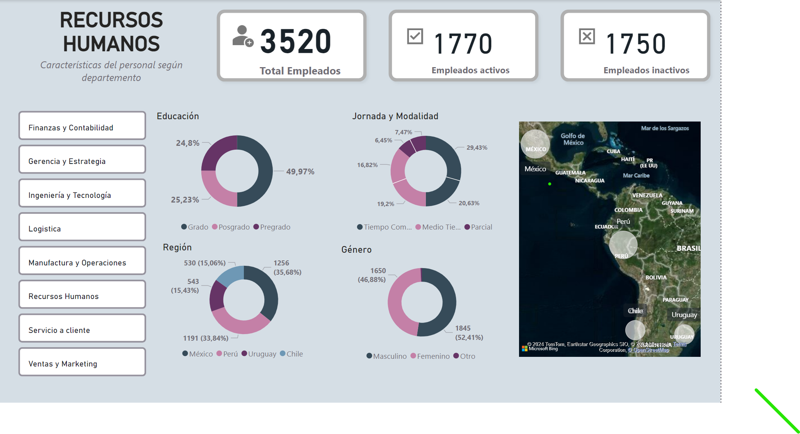

# <h1 align="center">**`Reporte POWER BI`**</h1>

##  **Objetivo**
- El presente dashboard proporciona una visión general valiosa del número de empleados activos y no activos en diferentes territorios de América.
- Los datos del dashboard se pueden utilizar para tomar decisiones estratégicas sobre la gestión de recursos humanos, como la asignación de recursos a diferentes territorios o la planificación de futuras contrataciones.

